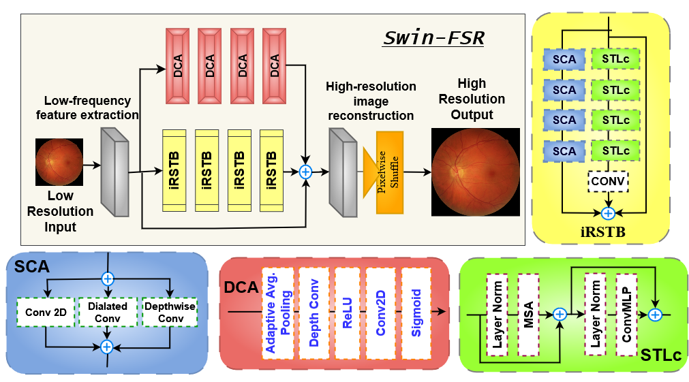

[](LICENSE)
[](https://arxiv.org/abs/2308.06332)
[](https://link.springer.com/chapter/10.1007/978-3-031-43990-2_65)

# \[MICCAI 2023\] SwinFSR: Advancing Super-Resolution of Fundus Images for SANS Visual Assessment Technology


Official PyTorch implementation of \[MICCAI 2023\] [**Revolutionizing Space Health (Swin-FSR): Advancing Super-Resolution of Fundus Images for SANS Visual Assessment Technology**](https://arxiv.org/abs/2201.01266).

\[[Paper](https://arxiv.org/abs/2312.06709)\]\[[BibTex](#citing-SwinFSR)\]

<br clear="left"/>

---

## Abstract
Swin-FSR is a groundbreaking model designed to address the challenges of super-resolution imaging in remote and constrained environments. Leveraging Swin Transformer with spatial and depth-wise attention mechanisms, Swin-FSR achieves remarkable results in enhancing the resolution of fundus images, crucial for accurate disease identification. With a Peak signal-to-noise-ratio (PSNR) of 47.89, 49.00, and 45.32 on prominent datasets such as iChallenge-AMD, iChallenge-PM, and G1020, respectively, Swin-FSR demonstrates its efficacy in improving image quality across diverse visual domains. Additionally, when applied to the analysis of images related to Spaceflight Associated Neuro-Ocular Syndrome (SANS), Swin-FSR yields comparable results to previous architectures, showcasing its versatility and robustness in various medical imaging applications


<div align="left">
  
</div>

## Results

### Model stats and summarization metrics:


## Citing SwinFSR

If you find this repository useful, please consider giving a star and citation:

#### MICCAI 2023 Reference:
```bibtex
@inproceedings{hossain2023revolutionizing,
  title={Revolutionizing space health (Swin-FSR): advancing super-resolution of fundus images for SANS visual assessment technology},
  author={Hossain, Khondker Fariha and Kamran, Sharif Amit and Ong, Joshua and Lee, Andrew G and Tavakkoli, Alireza},
  booktitle={International Conference on Medical Image Computing and Computer-Assisted Intervention},
  pages={693--703},
  year={2023},
  organization={Springer}
}
```

#### ArXiv Reference:
```bibtex
@article{hossain2023revolutionizing,
  title={Revolutionizing Space Health (Swin-FSR): Advancing Super-Resolution of Fundus Images for SANS Visual Assessment Technology},
  author={Hossain, Khondker Fariha and Kamran, Sharif Amit and Ong, Joshua and Lee, Andrew G and Tavakkoli, Alireza},
  journal={arXiv preprint arXiv:2308.06332},
  year={2023}
}
```
